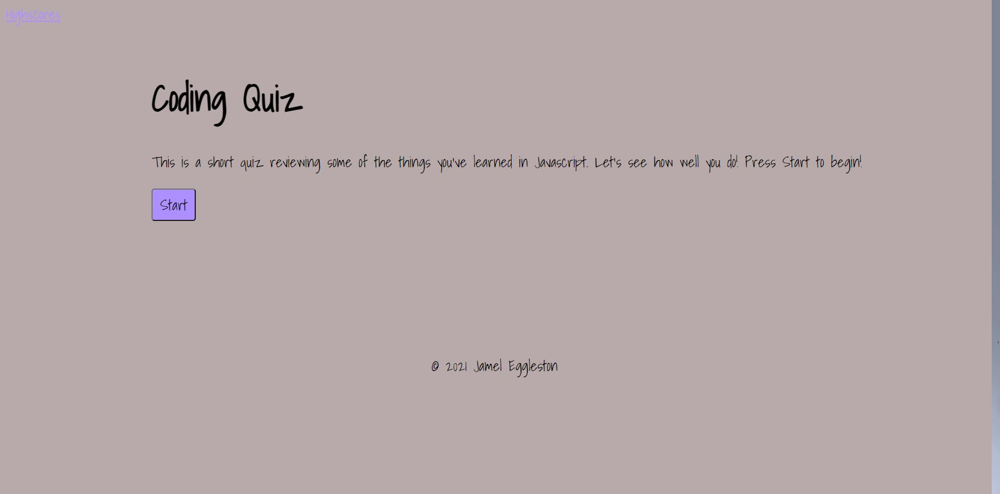

# JavaScript Fundamentals Quiz

Test your knowledge! You can become a javascript guru today. This short quiz will test your knowledge on the fundamentals of Vanilla JavaScript.
 
## Table of Contents
* [Usage](#Usage)
* [Test](#Test)
* [Questions](#Questions)

## Usage
Once you load the page hit the start button to begin! 

## Test

## Questions
Do you have questions? Contact me here:

* [Github](https://github.com/jameleggleston)
* [Email](jamel.eggleston@gmail.com)

Here is a link to the [website](https://jameleggleston.github.io/JavaScript-Fundamentals-Quiz/)

[Back to Top](#javascript-fundamentals-quiz)
 
